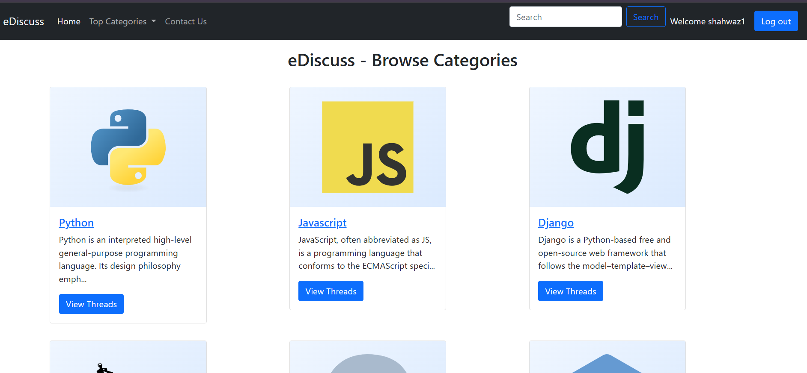
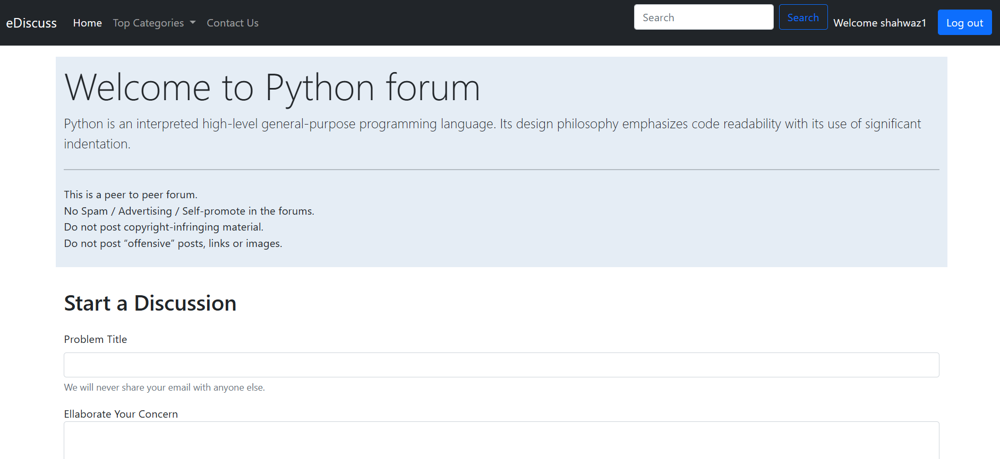
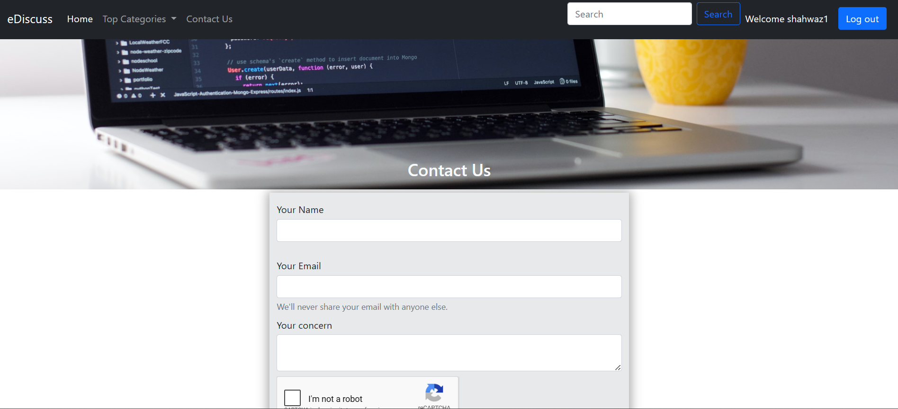

# eDiscuss Coding Forum

eDiscuss is an online forum web application where programmers can ask coding-related questions and share ideas with the community.

## Preview





## Requirements

- Docker
- A built app image for this project

## Docker Setup

### 1. Create a bridge network

```powershell
docker network create forum_net
```

### 2. Create a volume for MySQL data (optional)

```powershell
docker volume create forum_db
```

### 3. Start the MySQL container

```powershell
docker run -d `
  --name forum_mysql_db `
  --network forum_net `
  -e MYSQL_ROOT_PASSWORD=root `
  -v ${PWD}\database\ediscuss.sql:/docker-entrypoint-initdb.d/ediscuss.sql `
  -v forum_db:/var/lib/mysql `
  mysql:8.0
```

### 4. Start the forum application container

Replace `forum:` with your built image name.

```powershell
docker run -d -p 8080:80 `
  --name forum-app `
  --network forum_net `
  forum:
```

### 5. Open the app

Visit:

```text
http://localhost:8080
```

## Optional: phpMyAdmin

```powershell
docker run -d -p 8081:80 `
  --name forum_db_admin `
  --network forum_net `
  -e PMA_HOST=forum_mysql_db `
  phpmyadmin/phpmyadmin
```

Then open:

```text
http://localhost:8081
```
